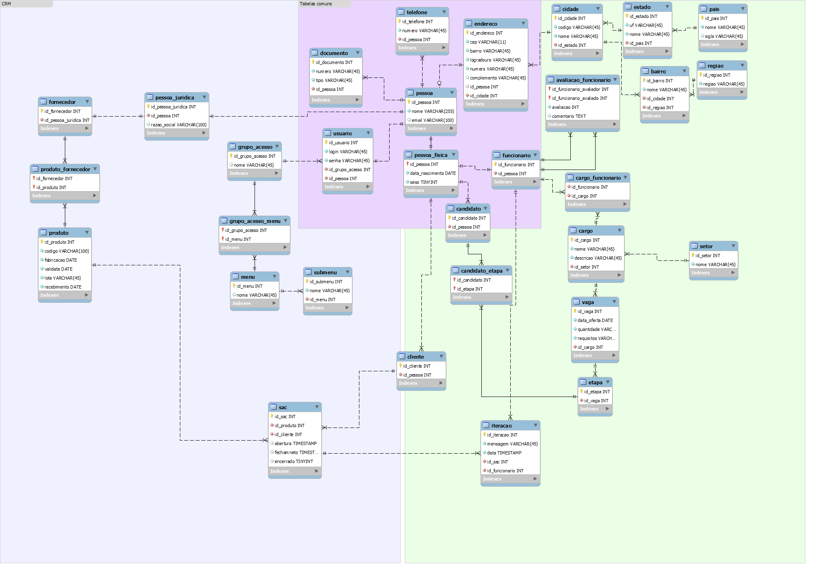
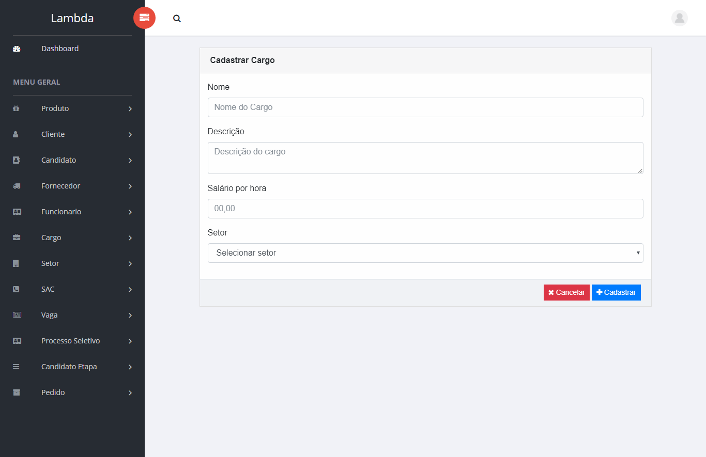
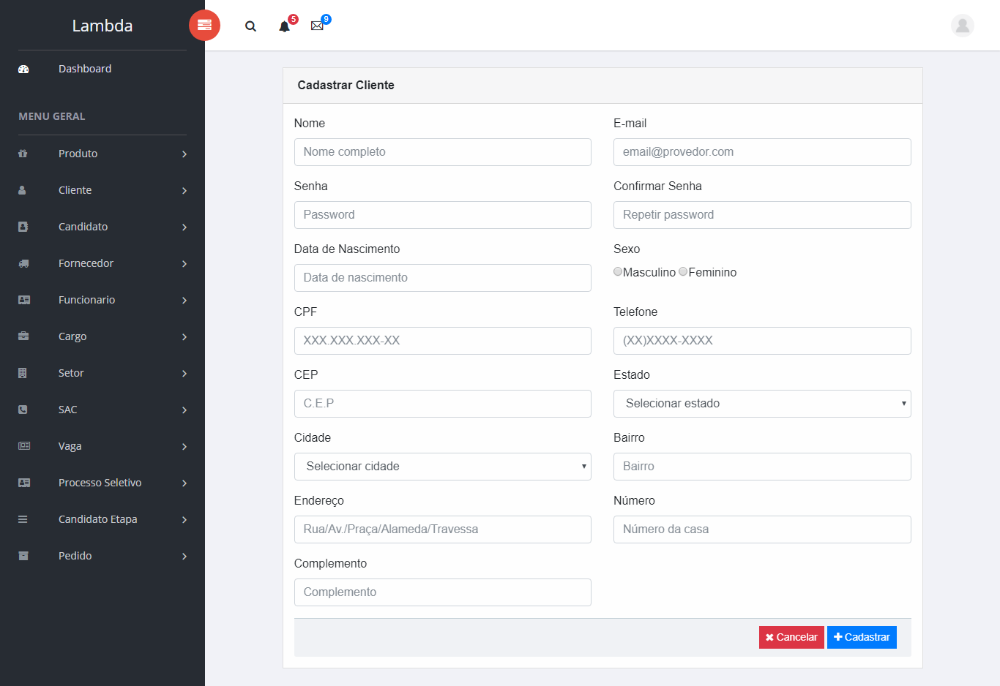
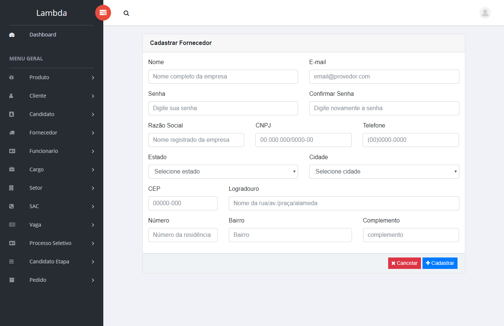
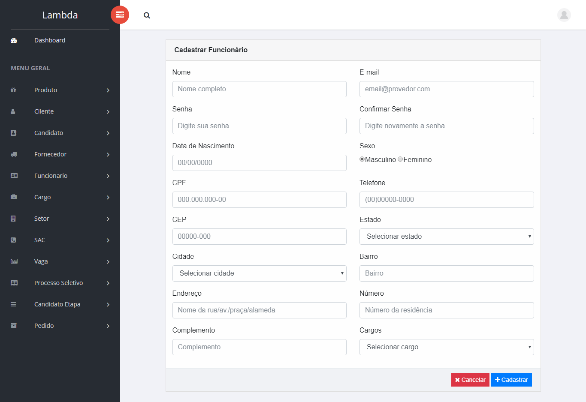
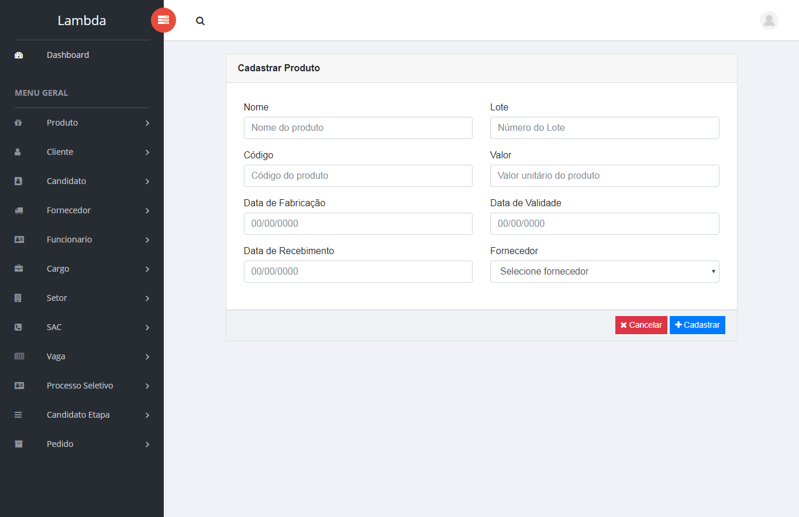
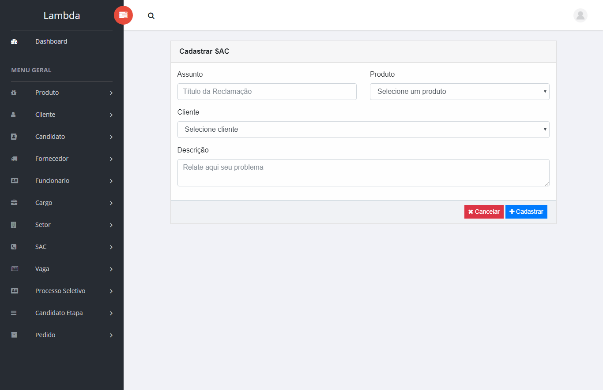
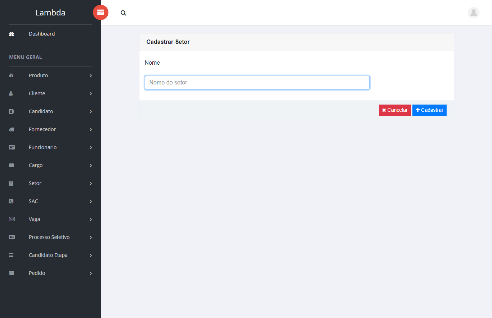
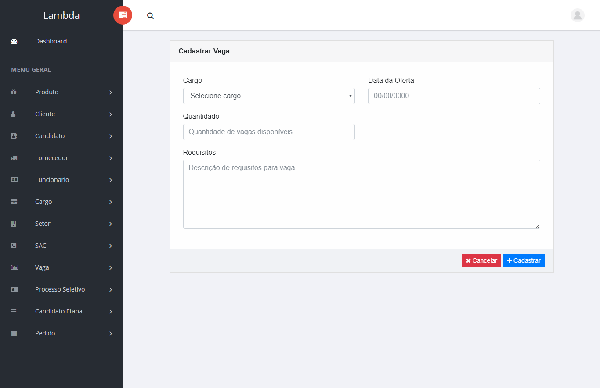

# Projeto

- Introdução
- Requisitos de Sistema
- Desenvolvimento
- Linguagens
- Frameworks
- Banco de Dados
- Metodologia
- Ferramentas
- Controle de Versões
- Arquitetura MVC
- Níveis de acessos
- Arquitetura MVC
  - Models
  - Controllers
  - Views
- Requisitos de Sistema
  - Requisitos funcionais
  - Requisitos não-funcionais
  - Requisitos de processo
  - Requisitos de produto
  - Requisitos externos
- Padrões de projeto
- Padrões de código
- Padrões de UI
- Manual do Usuário

## Introdução
O sistema em desenvolvimento tem o objetivo de auxiliar empresas a agilizar o gerenciamento de clientes, funcionários e produtos. Neste sentido, pode-se afirmar que se trata de um sistema ERP -- Enterprise Resource Planning, ou Planejamento de Recursos Empresarias com foco nos módulos de CRM e HRM.

O termo CRM significa Customer Relationship Management, ou Gestão de Relacionamento com o Cliente. Por meio do sistema de CRM, uma empresa consegue manter um banco de dados detalhado de cada cliente, bem como um histórico de interações e pedidos que ajuda a enriquecer e personalizar atendimentos futuros.

Sendo uma solução voltada à empresas de varejo, o sistema também oferece formulário para gerenciar fornecedores e seus produtos.

Com o sistema HRM (Human Resource Management, ou Gerenciador de Recursos Humanos) é possível controlar todos os processos ligados ao RH e gestão de pessoas. É possível ter um cadastro dos funcionários, histórico de cargos, currículo do funcionário, folha de pagamento, banco de horas, faltas, folgas, férias, processo de seleção e todas as informações relevantes sobre as pessoas trabalhando na empresa.

## Requisitos de Sistema
Embora o cliente tenha explicitado um conjunto de necessidades que deverão ser atendidas pelo sistema para solucionar o problema do seu negócio, coube à equipe de consultores identificar a real necessidade do negócio e deduzir os requisitos de sistema.

Requisitos funcionais e não-funcionais em: _01a-requisitos_sistema.md_

## Desenvolvimento
Linguagens e ferramentas utilizados no desenvolvimento:

### Linguagens
- HTML5 -- HyperText Markup Language
- PHP (HyperText Preprocessor)
- CSS (Cascading Style Sheets)
- JavaScript e biblioteca JQuery
- Markdown -- linguagem de marcação para documentação

### Frameworks
- CodeIgniter
- Bootstrap
- Ajax

### Banco de Dados
- MySQL

Diagrama entidade-relacionamento (DER)



## Metodologia
A metodologia utilizada para o desenvolvimento do projeto foi a metodologia ágil Scrum.

### Ferramentas
- MySQL Workbench
- Trello
- Google Drive
- Navegadores de internet
- IDEs
- FontAwesome

### Controle de Versões
O controle das versões do sistema é mantido no Github, acessado pelo link: https://github.com/projeto-hrm-crm/projeto

### Arquitetura MVC
O sistema desenvolvido neste projeto aplica o padrão MVC com o uso do framework **CodeIgniter** para desenvolvimento em PHP.

As classes e pastas que compõe a estrutura do projeto estão listadas em: _01a-arquiteturaMVC.md_

### Níveis de acesso
Para acessar o sistema é necessário que o usuário esteja cadastrado no sistema.
O Projeto conta com 4 tipos de usuários:
- Administrador:
Tem total acesso ao sistema.
- Funcionário:
Tem acesso aos módulos:

  - Candidato:
  Tem acesso aos processos seletivos disponíveis, para inscrição e monitoramento de inscrições anteriores.
  - Cliente:
  Tem acesso ao módulo de SAC, podendo apenas criar atendimentos e consultar os atendimentos anteriores.
  - Fornecedor:
  Pode ver os produtos que fornece à empresa.

  ### Arquitetura MVC

  Model-view-controller (MVC), em português modelo-visão-controlador, é um padrão de arquitetura de software que separa a representação da informação da interação do usuário. É normalmente usado para o desenvolvimento de interfaces de usuário que divide uma aplicação em três partes interconectadas. A utilização do padrão MVC trás como benefício isolar as regras de negócios da lógica de apresentação, a interface com o usuário. Isto possibilita a existência de várias interfaces com o usuário que podem ser modificadas sem que haja a necessidade da alteração das regras de negócios, proporcionando assim muito mais flexibilidade e oportunidades de reuso das classes. O padrão de projeto MVC separa estes componentes maiores possibilitando a reutilização de código e desenvolvimento paralelo de maneira eficiente. Esta arquitetura também facilita atualizações.

  O **modelo (model)** consiste nos dados da aplicação, regras de negócios, lógica e funções. A **visão (view)** pode ser qualquer saída de representação dos dados, como uma tabela ou um diagrama. É possível ter várias visões do mesmo dado, como um gráfico de barras para gerenciamento e uma visão tabular para contadores. É a interface com a qual o usuário irá interagir. O **controlador (controller)** faz a mediação da entrada, convertendo-a em comandos para o modelo ou visão. A comunicação entre interfaces e regras de negócios é definida através de um controlador, e é a existência deste controlador que torna possível a separação entre as camadas. Quando um evento é executado na interface gráfica, como um clique em um botão, a interface irá se comunicar com o controlador que por sua vez se comunica com as regras de negócios. As ideias centrais por trás do MVC são a reusabilidade de código e separação de conceitos.

  Portanto, a principal ideia do padrão arquitetural MVC é a separação dos conceitos - e do código. O MVC é como a clássica programação orientada a objetos, ou seja, criar objetos que escondem as suas informações e como elas são manipuladas e então apresentar apenas uma simples interface para o mundo. Entre as diversas vantagens do padrão MVC estão a possibilidade de reescrita da GUI ou do controller sem alterar o nosso modelo, reutilização da GUI para diferentes aplicações com pouco esforço, facilidade na manutenção e adição de recursos, reaproveitamento de código, facilidade de manter o código sempre limpo, etc.

  *(**Origem:** Wikipédia e DevMedia).*

  A aplicação desenvolvida neste projeto aplica o padrão MVC com o uso do framework **CodeIgniter** para desenvolvimento em PHP. A seguir listamos as classes, as pastas e os arquivos que compõem a estrutura do projeto.

  ### Models

  Estes são os _models_ que compõem o projeto e cada _model_ é uma classe/arquivo .php

  - Andamento_model
  - Candidato_model
  - CandidatoEtapa_model
  - Cargo_model
  - Cidade_model
  - Cliente_model
  - Documento_model
  - Endereco_model
  - Estado_model
  - Etapa_model
  - Fornecedor_model
  - Funcionario_model
  - Grupo_model
  - Iteracao_model
  - Log_model
  - Pais_model
  - Menu_model
  - Pessoa_model
  - PessoaFisica_model
  - PessoaJuridica_model
  - ProcessoSeletivo_model
  - Produto_model
  - Sac_model
  - Setor_model
  - Submenu_model
  - Telefone_model
  - Usuario_model
  - Vaga_model

  ### Controllers
  Estes são os _controllers_ que compõem o projeto e cada _controller_ é uma classe/arquivo .php

  - Candidato
  - CandidatoEtapa
  - Cargo
  - Cidade
  - Cliente
  - Email
  - Estado
  - Fornecedor
  - Funcionario
  - Home
  - Log
  - Login
  - Pedido
  - Perfil
  - Pessoa
  - Processo_Seletivo
  - Produto
  - Sac
  - Seed
  - Setor
  - Teste_Controller
  - Usuario
  - Vaga

  ### Views
  Os arquivos das _views_ do projeto estão organizadas nas pastas listadas a seguir:

  - candidato
  - candidato_etapa
  - cargo
  - cliente
  - email
  - errors
  - fornecedor
  - funcionario
  - home
  - images
  - includes
  - login
  - pedido
  - perfil
  - pessoa
  - processo_seletivo
  - produto
  - sac
  - setor
  - vaga

  ## Requisitos Funcionais

  O sistema tem como objetivo auxiliar no gerenciamento de clientes, funcionários e o serviço de atendimento ao consumidor. Os requisitos que seguem descrevem as funcionalidades que o sistema deve prover:

  <table>
  <!--start table-->

  <tr>
  <th>Identificação</th>
  <th>Nome</th>
  </tr>

  <tr>
  <td>RF 001</td>
  <td>Gerenciar perfis</td>
  <tr>
  <td colspan = "2">
  <strong>Descrição</strong>: Possibilita que o usuário com perfil de Administrador, identificado no sistema, cadastre, altere e exclua níveis de acesso do sistema.
  </td>
  </tr>

  <tr>
  <td>RF 002</td>
  <td>Gerenciar Usuário</td>
  <tr>
  <td colspan = "2">
  <strong>Descrição</strong>: Possibilita que o usuário com perfil de Administrador, identificado no sistema, cadastre, altere e exclua o cadastro de usuários do sistema.
  </td>
  </tr>

  <tr>
  <td>RF 003</td>
  <td>Gerenciar Cliente</td>
  <tr>
  <td colspan = "2">
  <strong>Descrição</strong>: Possibilita que o usuário com perfil de Administrador ou Funcionário, identificado no sistema, cadastre, altere e exclua o cadastro de clientes do sistema.
  </td>
  </tr>

  <tr>
  <td>RF 004</td>
  <td>Gerenciar Funcionário</td>
  <tr>
  <td colspan = "2">
  <strong>Descrição</strong>: Possibilita que o usuário com perfil de Administrador, identificado no sistema, cadastre, altere e exclua o cadastro de funcionários do sistema.
  </td>
  </tr>

  <tr>
  <td>RF 005</td>
  <td>Gerenciar Candidato</td>
  <tr>
  <td colspan = "2">
  <strong>Descrição</strong>: Possibilita que o usuário com perfil de Administrador ou Funcionário, identificado no sistema, cadastre, altere e exclua o cadastro de candidatos do sistema.
  </td>
  </tr>

  <tr>
  <td>RF 006</td>
  <td>Gerenciar Fornecedor</td>
  <tr>
  <td colspan = "2">
  <strong>Descrição</strong>: Possibilita que o usuário com perfil de Administrador ou Funcionário, identificado no sistema, cadastre, altere e exclua o cadastro de fornecedores do sistema.
  </td>
  </tr>

  <tr>
  <td>RF 007</td>
  <td>Gerenciar Setor</td>
  <tr>
  <td colspan = "2">
  <strong>Descrição</strong>: Possibilita que o usuário com perfil de Administrador, identificado no sistema, cadastre, altere e exclua o cadastro de candidatos do sistema.
  </td>
  </tr>


  <tr>
  <td>RF 008</td>
  <td>Gerenciar Vaga</td>
  <tr>
  <td colspan = "2">
  <strong>Descrição</strong>: Possibilita que o usuário com perfil de Administrador, identificado no sistema, cadastre, altere e exclua o cadastro de vagas do sistema.
  </td>
  </tr>

  <tr>
  <td>RF 009</td>
  <td>Gerenciar Produto</td>
  <tr>
  <td colspan = "2">
  <strong>Descrição</strong>: Possibilita que o usuário com perfil de Administrador, identificado no sistema, cadastre, altere e exclua o cadastro de produtos do sistema.  E o usuário com perfil de Fornecedor acompanhe sua lista de produtos fornecidos.
  </td>
  </tr>

  <tr>
  <td>RF 010</td>
  <td>Gerenciar Cargo</td>
  <tr>
  <td colspan = "2">
  <strong>Descrição</strong>: Possibilita que o usuário com perfil de Administrador, identificado no sistema, cadastre, altere e exclua o cadastro de cargos do sistema.
  </td>
  </tr>

  <tr>
  <td>RF 011</td>
  <td>Gerenciar Email</td>
  <tr>
  <td colspan = "2">
  <strong>Descrição</strong>: Possibilita que o usuário com perfil de Administrador selecione parâmetros e envie e-mails automáticos em nome da empresa para usuários e candidatos.
  </td>
  </tr>

  <tr>
  <td>RF 012</td>
  <td>Gerenciar Pedido</td>
  <tr>
  <td colspan = "2">
  <strong>Descrição</strong>: Possibilita que o usuário com perfil de Administrador, identificado no sistema, cadastre, altere e exclua o cadastro de clientes do sistema.  E o usuário com perfil de Cliente acompanhe a situação de sua pedido.
  </td>
  </tr>

  <tr>
  <td>RF 013</td>
  <td>Gerenciar Processo Seletivo</td>
  <tr>
  <td colspan = "2">
  <strong>Descrição</strong>: Possibilita que o usuário com perfil de Administrador, identificado no sistema, cadastre, altere e exclua o cadastro de processos seletivos do sistema. E usuário com perfil de Candidato previamente cadastrado confira sua situação no processo seletivo.
  </td>
  </tr>

  <tr>
  <td>RF 014</td>
  <td>Gerenciar SAC</td>
  <tr>
  <td colspan = "2">
  <strong>Descrição</strong>: Possibilita que o usuário com perfil de Administrador, identificado no sistema, cadastre, altere e exclua o cadastro de clientes do sistema. E o usuário com perfil de Cliente acompanhe a situação de sua ordem de serviço.
  </td>
  </tr>


  <!--end of table-->
  </table>

  ## Requisitos Não-Funcionais

  Os requisitos que descrevem os aspectos não-funcionais do sistema são apresentados a seguir e foram divididos nas categorias de processo, de produto e externos:

  ### Requisitos de Processo
  Os requisitos de processo estão relacionados ao processo de desenvolvimento do sistema.

  Identificação	| Descrição
  --- | ---
  RNF 001	| Utilização de SCRUM como o processo para o desenvolvimento do sistema
  RNF 002	| Deve-se utilizar SQL padrão, para se ter independência de banco de dados
  RNF 003	| A camada de apresentação utilizará o Framework Bootstrap para facilitar o tratamento das ações dos usuários.
  RNF 004	| Todo o sistema deverá ser desenvolvido utilizando o padrão de software MVC.
  RNF 005	| O sistema deverá ser desenvolvido em PHP, utilizando o framework CodeIgniter.
  RNF 006	| 	O banco de dados que suportará o ambiente será o MySQL.


  ### Requisitos de Produto
  Os requisitos de produto estão relacionados às características desejadas que o sistema deve ter.

  Identificação	| Descrição
  --- | ---
  RNF 007	| As mensagens de erro do sistema deverão ser precisas e construtivas, fazendo com que o usuário identifique sua origem e como proceder após sua ocorrência.
  RNF 008	| A interface do sistema deverá ser agradável e objetiva, ou seja, suas funcionalidades e informações deverão estar bem intuitivas. Os usuários administrativos (administradores e funcionários) após curto tempo de treinamento devem ser capazes de operar o sistema como um todo, diminuindo a necessidade de consultas ao sistema de suporte, helpdesk, para a execução de suas tarefas.
  RNF 009	| O sistema deve ser independente de  plataforma.
  RNF 010	| O sistema deve ser independente de tipo de navegador.
  RNF 011	| O sistema deve estar sempre disponível.
  RNF 012	| Os dados não podem ser corrompidos. Os dados serão mantidos e gerenciados por um SGBD.
  RNF 013	| A base de dados deve estar sempre íntegra.
  RNF 013	| Os dados que o usuário entra no sistema deverão ser validados a fim de evitar que dados errôneos sejam armazenados prejudicando a corretude e consistência da base de dados.
  RNF 014	| O sistema deve ter um tempo de resposta a consultas de no máximo 5 segundos.
  RNF 015	| O sistema deverá suportar até 5.000 acessos simultâneos.
  RNF 016	| Será utilizado um padrão de codificação especificado no documento de arquitetura.
  RNF 017	| Padrões de projetos serão utilizados a fim de evitar soluções não reusáveis de programação.

  ### Requisitos Externos
  Os requisitos externos são derivados do ambiente no qual o sistema está sendo desenvolvido.

  Identificação	| Descrição
  --- | ---
  RNF 018	| O tempo com o desenvolvimento, implantação e treinamento do sistema não poderá superar a data estimada no calendário de desenvolvimento proposto.

  # Padrões do Projeto 

  ## Introdução
  A fim de facilitar o trabalho em grupo, foram definidos padrões de front-end e back-end, assim, com a mudança de uma sprint e a possível mudança de função de algum membro da equipe, não haveria problemas de adaptação ao código.

  A padronização da interface do usuário também foi implementada, necessária para facilitar a navegação do usuário em qualquer nível de acesso (administrador, funcionário, cliente, fornecedor ou candidato) e manter o design coeso.

  ## Padrões de código
  Desde o início do projeto, foram delimitados padrões para nomenclaturas, funções e variáveis.

  Os padrões básicos do código estão descritos em: _03a-Padrões_código.md_

  ## Padrões da interface do usuário
  Os padrões de interface foram modificadas levemente ao longo do desenvolvimento do projeto buscando um acesso cada vez mais prático para os usuários futuros. Portanto, foram definidos padrões para os botões, tabelas, tamanho de colunas e outros elementos visuais.

  Os padrões da ui estão descritos em: _03b-Padrões_UI.md_

  # Padrões (Convenções)
  ## 1. Nomenclatura
  ### 1.1. Controllers e Rotas
  Por conta da utilização do nome do controller na criação das rotas mágicas do CodeIgniter
  os nomes dos controllers recebem os nomes dos objetos a serem utilizados.

  Por convenção, todos os nomes de controllers devem estar no **SINGULAR**
  ````php
  <?php
  // Curso terá controle sobre as rotas em http://localhost/curso
  class Curso extends CI_Controller
  {
      // Rota: http://localhost/curso/index
      //       http://localhost/curso
      public function index() { echo 'página inicial'; }

      // Rota: http://localhost/curso/cadastrar
      public function create() { echo 'cadastro de curso'; }
  }
  ````

  ### 1.2 Nomes das funções no controller
  - **index**: Lista de resultados, página inicial;
  - **create**: Formulário de cadastro, chama função insert do model;
  - **edit**: Formulário de edição, chama função update do model;
  - **delete**: Remove do banco;  

  **Obs:** As demais funções necessárias devem seguir este padrão, sendo sempre verbos;  
  **Obs²:** Para manter a utilização correta e fácil busca, qualquer função de ação
  que não seja lista ou página inicial utilizada no *index* não deve ser implementada
  em *index*, mas em uma função específica que será chamada.

  **Exemplo**: O Fornecedor não tem página inicial, ele vai direto para o cadastro:
  ````php
  <?php
  class Fornecedor extends CI_Controller
  {
      public function index()
      {
          $this->create();
      }

      public function create()
      {
          // Lógica para o cadastro de Fornecedor
      }
  }
  ````

  ****

  ## 2. Modelos e Banco de Dados
  ### 2.1 Tabelas e nome de modelos
  O nome dos modelos devem seguir o padrão **Tabela_model**, isso garante que nenhuma
  outra classe sobrescreva ou seja sobrescrita pelo modelo.
  ````php
  <?php
  class Blog_model extends CI_Model
  {

          public $title;
          public $content;
          public $date;

          public function get()
          {
                  $query = $this->db->get('entries', 10);
                  return $query->result();
          }

          public function insert()
          {
                  $this->title    = $this->input->post('title');
                  $this->content  = $this->input->post('content');
                  $this->date     = time();

                  $this->db->insert('entries', $this);
          }

          public function update()
          {
                  $this->title    = $this->input->post('title');
                  $this->content  = $this->input->post('content');
                  $this->date     = time();

                  $this->db->update('entries', $this, array('id' => $this->input->post('id')));
          }

  }
  ````
  ### 2.2 Nomes das funções no model
  - **insert**: Salva os dados no banco;
  - **get**: Recupera os registros da tabela;
  - **update**: Atualiza os dados no banco;
  - **remove**: Remove os dados do banco;

  Algumas regras utilizadas:
   - Nomes de tabelas sempre no **SINGULAR**;
   - Atributos chaves primárias devem ser nomeadas com o nome da tabela seguido por 'id';
   - Ids de chaves estrangeiras sempre no **SINGULAR**;
   - Nome de campos e tabelas em **MINÚSCULO** e utilizando **snake_case**:  
   **Ex:** `cursos_semestres` e `curso_id`;

  ## 3 Views
  ### 3.1 Nome das views
  As views devem conter pelo menos as páginas index, cadastrar e editar.

  Todas as páginas devem estar contidas em um diretório com o nome de sua respectiva funcionalidade,
  dentro do diretório views.

  Todas as páginas devem ser nomeadas com inicial minúscula.
  ### 3.2 Estrutura do diretório views
  ```
  ├── views/
  │   ├── fornecedor
  │   │   ├── index.php
  │   │   ├── cadastrar.php
  │   │   ├── editar.php

  ```

  ## 4 Geral
  ### Nome de variáveis
  As variáveis precisam ser explicativas. Não usar, de forma alguma, variáveis que não fazem sentido, exemplo:

  #### Não fazer
  `$a = "Ta errado isso aqui"`;

  #### Fazer
  `$usuarios = "Correto"`;
  `$total_linhas = "Correto"`;

  ### Variáveis compostas
  As variáveis compostas seguirão o padrão snake case:

  #### Não fazer
  `$minhaVariavelComposta = "ERRADO"`;

  #### Fazer
  `$minha_variavel_composta = "CERTO"`;

  ### Nome de métodos
  Os métodos seguirão o padrão camel case:

  #### Não fazer
  `public function meu_metodo(){}`

  #### Fazer
  `public function meuMetodo(){}`

  ### Comentários
  A fim de não haver problemas ou duplicação de código desnecessário, haverá obrigatoriedade de comentários em cada método criado e os comentários seguirão o seguinte padrão:

  ````php
  <?php
  class Usuarios extends CI_Controller
  {
        /**
        *@author: Fulano de tal
        * Essa método tem a finalidade de filtrar usuários
        * por uma data especificada.
        *
        * @param $data_comeco String
        * @param $data_fim    String
        * @return mixed
        */
        public function buscarUsuariosPelaData($data_comeco, $data_fim)
        {
           // Corpo do método
        }
  }
  ````
  # Padrões
  ## UI (interface do usuário)

  -	Todo botão de deletar e editar precisa necessariamente de uma confirmação antes da ação (modal). Ao clicar no botão de deletar, ele normalmente iria para uma página para deletar e após a exclusão do dado ele voltaria para a página de listagem; esse passo irá acontecer, porém, antes da requisição de exclusão ser completada, um modal precisa aparecer interrompendo o comportamento padrão da requisição (event.preventDefault). Se o usuário clicar em *sim*, ele prossegue com a requisição, caso ele clique em *cancelar* não faz nada, mata completamente a requisição. Em ambos os casos, o usuário continua na tela de listagem.

  -	Divs col-lg-10 (sistema grid -- padrão Bootstrap) e centralizadas.

  -	Css e JS customizados precisam ser inseridos no script do header. Para evitar carregamento de JS e CSS desnecessário à outras páginas adotou-se o padrão de carregar eles só quando necessário e direto pelo controller, já existe alguns controllers que fazem isso. Caso tenham algum arquivo JS e/ou CSS que só seja necessário em sua página adicione-o no array de assets.

  ### Listas

  - Título da lista deve ser o título referente à página.

  - Devem ser exibidos no máximo 10 resultados por página (a não ser que o usuário escolha opção diferente).

  - Botão de "Novo Cadastro" azul com ícone e letras brancos no canto superior esquerdo da lista (dentro do "card-body").
    - Bootstrap: class="btn btn-primary btn-sm"
    - Fontawesome: class="fa fa-check"

  - Barra de pesquisa no lado direito superior da lista.

  - Classe Bootstrap para a tabela de listagem: "table table-striped table-bordered datatable".

  ### Formulários
  -	Formulário com col-10 e os inputs precisam ter colunas diferentes para cada tela.  Quando temos uma tela de notebook/computador os botões não devem ficar um embaixo do outro (col-12), eles precisam, no mínimo, ficar um ao lado do outro (no mínimo col-6), apenas em telas menores os campos devem ocupar todo o tamanho da div.

  - Botão cancelar à esquerda de confirmar, ambos alinhados à direita.
    - Cancelar: Bootstrap -- class="btn btn-danger btn-sm"; Fontawesome -- class="fa fa-times"
    - Confirmar: Bootstrap -- class="btn btn-primary btn-sm"; Fontawesome --  class="fa fa-plus"

  ```html
  </div>
  <div class="card-footer text-right">
      <a title="Cancelar Cadastro" href="<?=site_url('candidato')?>" class="btn btn-danger btn-sm">
          <i class="fa fa-times"></i>
          Cancelar
      </a>
      <button title="Cadastrar Candidato" type="submit" class="btn btn-primary btn-sm" name="cadastrar">
          <i class="fa fa-plus"></i>
          Cadastrar
      </button>
  </div>
  ```

  - Formulário de edição deve conter o título "Atualizar *nome do formulário*". Ex.: Atualizar Candidato.

  - Formulário de cadastro deve conter o título "Cadastrar *nome do formulário*". Ex.: Cadastrar Candidato.

  - Colocar informação em todo *placeholder* de tipo texto.

  ```html
  <div class="form-group col-12 col-md-6">
      <label class=" form-control-label">Nome</label>
      <input type="text" id="nome"placeholder="Nome completo" name="nome" value = "<?php echo isset($old_data['nome']) ? $old_data['nome'] : null;?>" class="form-control" required>
  </div>
  ```

  ### Botões
  -	Cores dos botões (Bootstrap):
    - Botão de excluir (bg-danger) vermelho
    - Botão de cadastrar (bg-primary) azul
    - Botão de editar(bg-primary) azul


  - Ícones dos botões (Fontawesome):
    -	Botão de cadastro: https://fontawesome.com/v4.7.0/icon/plus/
    - Botão de exclusão: https://fontawesome.com/v4.7.0/icon/times/
    - Botão de edição: https://fontawesome.com/v4.7.0/icon/pencil-square-o/
    -	A cor dos ícones deve ser branca.


  -	Botão de cancelar à esquerda e botão de cadastrar à direita em *todos os formulários*.

  - Todos os botões de ação devem conter _title_.
  ```html
    <input type="submit" title="Excluir informação">
  ```
    ou
  ```html
    <button title="Editar informação">
  ```

  # Manual do Usuário

  As principais funcionalidades do sistema podem ser encontradas no MENU GERAL após realizar o login.

  O ícone vermelho no MENU GERAL tem a função de diminuir o menu para facilitar a visualização.

  O usuário deve estar atento a informações no cadastro que são obrigatórias.

  ## Candidato

  Referente à listagem, cadastro, edição e exclusão de candidatos concorrendo ao processo seletivo de contratação.

  - Página principal

  Nesta página, são listadas as informações principais de cada candidato já cadastrado. Aqui, é possível exclui-lo individualmente ao clicar no botão vermelho com um X no centro ao fim de cada linha.

  Também pode-se editar as informações individuais clicando no botão azul com o desenho de um lápis no centro. Ao clicar neste botão, o usuário é levado à página de editar o cadastro.

  Ao clicar no botão "cadastrar", o usuário é levado à página de cadastro.

  - Cadastrar

  

  Nesta página, o usuário pode cadastrar diversas informações pessoais do candidato e, ao fim do formulário, selecionar a vaga a qual se está concorrendo (uma vaga só aparecerá como opção se já tiver sido cadastrada). Após completar o cadastro e clicar no botão de salvar, as informações são salvas no banco de dados e exibidas na página principal em uma lista.

  O cadastro pode ser cancelado a qualquer momento clicando no botão "cancelar"; se clicado o botão, o usuário é redirecionado para a página principal.

  Todas as informações podem ser editadas posteriormente na página de edição do cadastro alcançada através do botão azul com um lápis na página principal do candidato.

  ## Cargo

  Referente à listagem, cadastro, edição e exclusão de cargos disponíveis no processo seletivo de contratação.

  - Página principal

  Nesta página, são listadas as informações principais de cada cargo já cadastrado. Aqui, é possível exclui-lo individualmente ao clicar no botão vermelho com um X no centro ao fim de cada linha.

  Também pode-se editar as informações individuais clicando no botão azul com o desenho de um lápis no centro. Ao clicar neste botão, o usuário é levado à página de editar o cadastro.

  Ao clicar no botão "cadastrar", o usuário é levado à página de cadastro.

  - Cadastrar

  

  Nesta página, o usuário pode cadastrar nome, descrição e selecionar o setor (um setor só aparecerá como opção para ser selecionado caso já esteja cadastrado). Após completar o cadastro e clicar no botão de salvar, as informações são salvas no banco de dados e exibidas na página principal em uma lista.

  O cadastro pode ser cancelado a qualquer momento clicando no botão "cancelar"; se clicado o botão, o usuário é redirecionado para a página principal.

  Todas as informações podem ser editadas posteriormente na página de edição do cadastro alcançada através do botão azul com um lápis na página principal do cargo.

  ## Cliente

  Referente à listagem, cadastro, edição e exclusão de clientes.

  - Página principal

  Nesta página, são listadas as informações principais de cada cliente já cadastrado. Aqui, é possível exclui-lo individualmente ao clicar no botão vermelho com um X no centro ao fim de cada linha.

  Também pode-se editar as informações individuais clicando no botão azul com o desenho de um lápis no centro. Ao clicar neste botão, o usuário é levado à página de editar o cadastro.

  Ao clicar no botão "cadastrar", o usuário é levado à página de cadastro.

  - Cadastrar

  

  Nesta página, o usuário pode cadastrar diversas informações pessoais do cliente. Após completar o cadastro e clicar no botão de salvar, as informações são salvas no banco de dados e exibidas na página principal em uma lista.

  O cadastro pode ser cancelado a qualquer momento clicando no botão "cancelar"; se clicado o botão, o usuário é redirecionado para a página principal.

  Todas as informações podem ser editadas posteriormente na página de edição do cadastro alcançada através do botão azul com um lápis na página principal do cliente.

  ## Fornecedor

  Referente à listagem, cadastro, edição e exclusão de fornecedores.

  - Página principal

  Nesta página, são listadas as informações principais de cada fornecedor já cadastrado. Aqui, é possível exclui-lo individualmente ao clicar no botão vermelho com um X no centro ao fim de cada linha.

  Também pode-se editar as informações individuais clicando no botão azul com o desenho de um lápis no centro. Ao clicar neste botão, o usuário é levado à página de editar o cadastro.

  Ao clicar no botão "cadastrar", o usuário é levado à página de cadastro.

  - Cadastrar

  

  Nesta página, o usuário pode cadastrar informações do fornecedor. Após completar o cadastro e clicar no botão de salvar, as informações são salvas no banco de dados e exibidas na página principal em uma lista.

  O cadastro pode ser cancelado a qualquer momento clicando no botão "cancelar"; se clicado o botão, o usuário é redirecionado para a página principal.

  Todas as informações podem ser editadas posteriormente na página de edição do cadastro alcançada através do botão azul com um lápis na página principal do fornecedor.

  ## Funcionário

  Referente à listagem, cadastro, edição e exclusão de funcionários.

  - Página principal

  Nesta página, são listadas as informações principais de cada funcionário já cadastrado. Aqui, é possível exclui-lo individualmente ao clicar no botão vermelho com um X no centro ao fim de cada linha.

  Também pode-se editar as informações individuais clicando no botão azul com o desenho de um lápis no centro. Ao clicar neste botão, o usuário é levado à página de editar o cadastro.

  Ao clicar no botão "cadastrar", o usuário é levado à página de cadastro.

  - Cadastrar

  

  Nesta página, o usuário pode cadastrar diversas informações pessoais do funcionário e, ao fim do formulário, selecionar seu cargo. Após completar o cadastro e clicar no botão de salvar, as informações são salvas no banco de dados e exibidas na página principal em uma lista.

  O cadastro pode ser cancelado a qualquer momento clicando no botão "cancelar"; se clicado o botão, o usuário é redirecionado para a página principal.

  Todas as informações podem ser editadas posteriormente na página de edição do cadastro alcançada através do botão azul com um lápis na página principal do funcionário.

  ## Produto

  Referente à listagem, cadastro, edição e exclusão de produtos.

  - Página principal

  Nesta página, são listadas as informações principais de cada produto já cadastrado. Aqui, é possível exclui-lo individualmente ao clicar no botão vermelho com um X no centro ao fim de cada linha.

  Também pode-se editar as informações individuais clicando no botão azul com o desenho de um lápis no centro. Ao clicar neste botão, o usuário é levado à página de editar o cadastro.

  Ao clicar no botão "cadastrar", o usuário é levado à página de cadastro.

  - Cadastrar

  

  Nesta página, o usuário pode cadastrar as informações do produto e selecionar o fornecedor (um fornecedor só aparecerá como opção se já tiver sido cadastrado). Após completar o cadastro e clicar no botão de salvar, as informações são salvas no banco de dados e exibidas na página principal em uma lista.

  O cadastro pode ser cancelado a qualquer momento clicando no botão "cancelar"; se clicado o botão, o usuário é redirecionado para a página principal.

  Todas as informações podem ser editadas posteriormente na página de edição do cadastro alcançada através do botão azul com um lápis na página principal do produto.

  ## SAC

  Referente à listagem, cadastro, edição e exclusão de serviço de atendimento ao consumidor.

  - Página principal

  Nesta página, são listadas as informações principais de cada SAC já cadastrado e se já foi solucionado. Aqui, é possível exclui-lo individualmente ao clicar no botão vermelho com um X no centro ao fim de cada linha.

  Também pode-se editar as informações individuais clicando no botão azul com o desenho de um lápis no centro. Ao clicar neste botão, o usuário é levado à página de editar o cadastro.

  Ao clicar no botão "cadastrar", o usuário é levado à página de cadastro.

  - Cadastrar

  

  Nesta página, o usuário pode cadastrar informações do SAC. Após completar o cadastro e clicar no botão de salvar, as informações são salvas no banco de dados e exibidas na página principal em uma lista.

  O cadastro pode ser cancelado a qualquer momento clicando no botão "cancelar"; se clicado o botão, o usuário é redirecionado para a página principal.

  Todas as informações podem ser editadas posteriormente na página de edição do cadastro alcançada através do botão azul com um lápis na página principal do SAC.

  ## Setor

  Referente à listagem, cadastro, edição e exclusão de setor.

  - Página principal

  Nesta página, são listadas as informações principais de cada setor já cadastrado. Aqui, é possível exclui-lo individualmente ao clicar no botão vermelho com um X no centro ao fim de cada linha.

  Também pode-se editar as informações individuais clicando no botão azul com o desenho de um lápis no centro. Ao clicar neste botão, o usuário é levado à página de editar o cadastro.

  Ao clicar no botão "cadastrar", o usuário é levado à página de cadastro.

  - Cadastrar

  

  Nesta página, o usuário pode cadastrar as informações do setor. Após completar o cadastro e clicar no botão de salvar, as informações são salvas no banco de dados e exibidas na página principal em uma lista.

  O cadastro pode ser cancelado a qualquer momento clicando no botão "cancelar"; se clicado o botão, o usuário é redirecionado para a página principal.

  Todas as informações podem ser editadas posteriormente na página de edição do cadastro alcançada através do botão azul com um lápis na página principal do setor.

  ## Vaga

  Referente à listagem, cadastro, edição e exclusão de vaga.

  - Página principal

  Nesta página, são listadas as informações principais de cada vaga já cadastrada. Aqui, é possível exclui-la individualmente ao clicar no botão vermelho com um X no centro ao fim de cada linha.

  Também pode-se editar as informações individuais clicando no botão azul com o desenho de um lápis no centro. Ao clicar neste botão, o usuário é levado à página de editar o cadastro.

  Ao clicar no botão "cadastrar", o usuário é levado à página de cadastro.

  - Cadastrar

  

  Nesta página, o usuário pode cadastrar as informações da vaga e selecionar o setor (um setor só aparecerá como opção se já tiver sido cadastrado). Após completar o cadastro e clicar no botão de salvar, as informações são salvas no banco de dados e exibidas na página principal em uma lista.

  O cadastro pode ser cancelado a qualquer momento clicando no botão "cancelar"; se clicado o botão, o usuário é redirecionado para a página principal.

  Todas as informações podem ser editadas posteriormente na página de edição do cadastro alcançada através do botão azul com um lápis na página principal da vaga.
